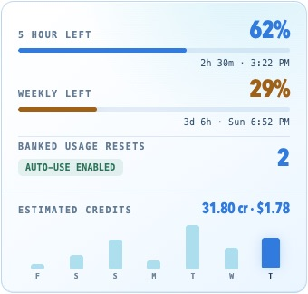
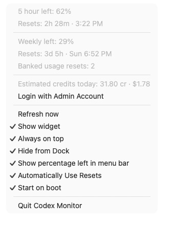

# Codex Usage Monitor

A compact macOS widget for tracking Codex usage limits and paid-credit activity. It stays above other windows, works across Spaces, and remains available from the menu bar when hidden.

The widget shows:

- Remaining usage in the active five-hour and weekly windows
- The reset time for each available window
- Banked usage resets and whether automatic use is enabled
- Seven days of actual paid Codex credits when Admin Console access is available
- A deliberately high local estimate when actual credit data is unavailable

## Preview

The blue widget shows usage limits, banked resets, and a seven-day credit chart. These screenshots use sample data with automatic resets enabled. Automatic resets are disabled by default on a new installation. The widget uses the same chart layout for actual and estimated credits, and collapses to one usage window when only one is available.



Click the menu-bar icon or percentage to open the menu. It includes Admin Console login, automatic resets, window settings, and startup controls.



## Requirements

- macOS on Apple silicon
- [Bun](https://bun.sh/)
- A working Codex login

The current packaging script targets `arm64`. Other architectures have not been tested.

## Install

Clone the repository and install:

```sh
git clone https://github.com/kbitgood/codex-usage-monitor.git
cd codex-usage-monitor
bun install
bun start
```

`bun start` builds the application, installs it at `/Applications/Codex Monitor.app`, and launches the installed copy.

To rebuild and install without launching:

```sh
bun run install:mac
```

## Update

Choose **Quit Codex Monitor** from the menu-bar menu first. In your existing repository checkout, run:

```sh
git pull --ff-only
bun install
bun start
```

This rebuilds and replaces `/Applications/Codex Monitor.app`, then launches the updated copy. Pulling the repository alone does not update the installed app. Saved preferences are retained.

## Development

```sh
bun test
bun run typecheck
bun run install:mac
```

Use `bun run dev` only when you specifically want the generic Electron development host. The packaged application has different login-item behavior, so final verification should use `/Applications/Codex Monitor.app`.

## Usage

The reset countdown updates every two seconds. Live limits are fetched at most every 15 seconds or immediately through **Refresh now**. Credit data refreshes once per minute.

Drag the usage area to move the widget. Resize it from any edge. Hover over the widget to reveal the hide button, or press `Escape`. Hover over a credit bar to see that day's credits and estimated dollar cost.

Click the menu-bar icon or percentage to change these settings:

- **Show widget** shows or hides the window.
- **Always on top** keeps the widget above other windows.
- **Hide from Dock** controls whether the app appears in the Dock.
- **Show percentage left in menu bar** displays the remaining percentage for the first available usage window beside the icon.
- **Automatically Use Resets** enables automatic consumption of banked usage resets.
- **Start on boot** launches the installed app at login.

### Automatic usage resets

**Automatically Use Resets** is off by default. Enable it in the menu-bar menu. The widget shows **AUTO-USE ENABLED** or **AUTO-USE DISABLED** beneath the banked reset count.

When a usage window reaches 100% used and has not yet expired, the monitor checks live usage again. It consumes one reset only when the live response reports both a banked reset and an applicable reset. It saves the attempt before sending the request, makes at most one attempt for that exhausted window, and refreshes usage afterward. Failed attempts are logged and are not automatically retried for the same window.

The banked reset count is `--` when unavailable. This setting uses your banked resets; it does not purchase resets or paid credits.

## Data sources

### Usage limits

The application reads the Codex login from `$CODEX_HOME/auth.json`, normally `~/.codex/auth.json`, and requests the same live usage information used by Codex status views. It does not display or copy the login token. If the live request fails, the monitor falls back to the newest `token_count` event in the local Codex rollout files.

### Actual paid credits

Choose **Login with Admin Account** from the menu-bar menu to sign in through a separate Admin Console window. When that session can access credit analytics, the monitor uses the actual results. Electron keeps this login in a dedicated persistent browser session. The application does not extract or save browser cookies.

The chart then displays actual paid Codex credits for the last seven days.

### Estimated credits

When there is no active Admin Console login or the account cannot access credit analytics, the monitor automatically shows the same chart under the title **Estimated Credits**. The estimate is intentionally biased high:

- Requests reported at 99% or 100% usage are included.
- The full request that crosses the included limit is counted.
- Usage continues to count until the exhausted window resets.
- Missing model metadata uses GPT-6 Astra credit rates.
- Missing or Fast effective service-tier metadata adds a 2.5x Fast-mode reserve.

The estimate covers Codex activity recorded locally on that Mac. It may still omit cloud tasks, activity on other computers, and separately billed tools.

## Privacy and limitations

The monitor reads local Codex authentication and session files. It sends the existing access token to OpenAI's Codex usage endpoint and, when automatic resets are enabled, to OpenAI's reset-consumption endpoint. It uses the isolated Admin Console browser session only with OpenAI domains.

The live usage and reset-consumption endpoints, rollout-file format, and Business Admin Console credit endpoint are undocumented. OpenAI may change them without notice, which can require an application update.
